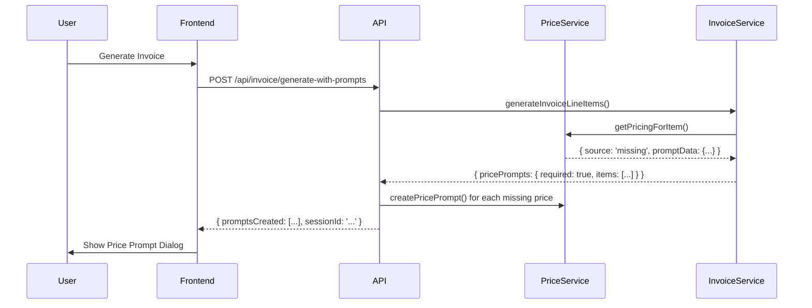
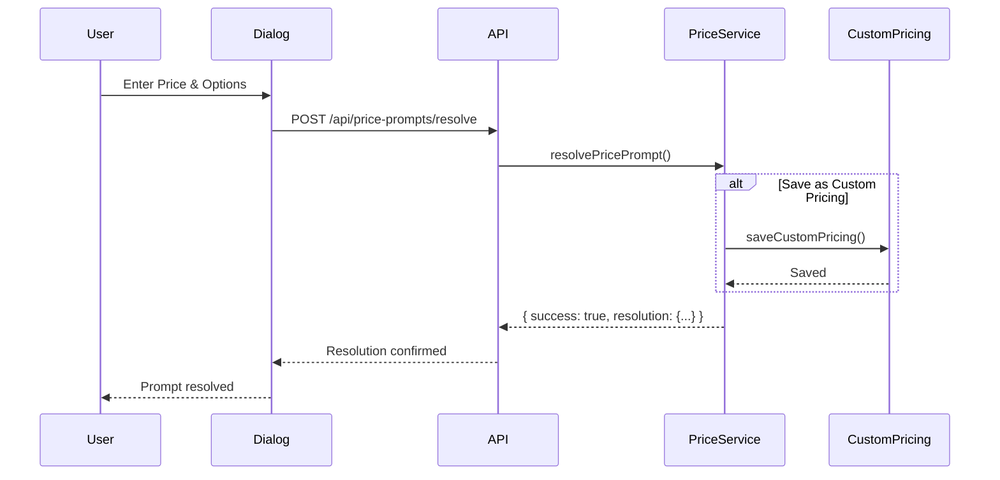
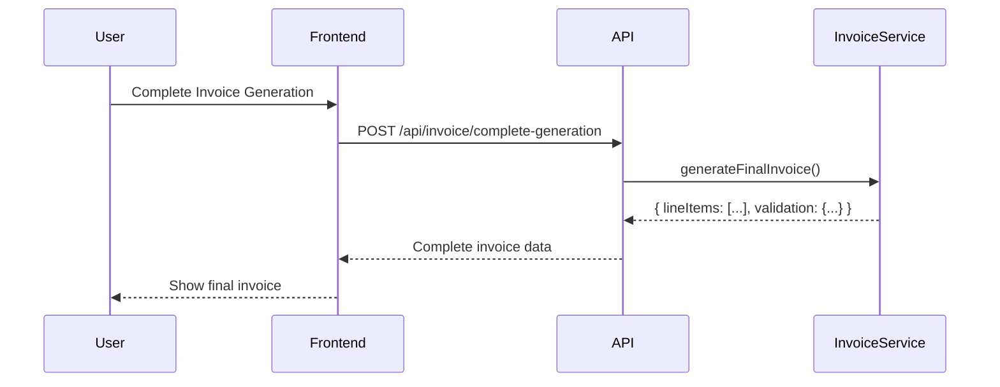

# Price Prompt System Documentation

## Overview

The Price Prompt System is a comprehensive solution for handling missing prices during single invoice generation. When the dynamic pricing system cannot find a price for an NDIS item, it creates a prompt that allows users to provide the missing price through an intuitive interface.

## Architecture

### Backend Components

#### 1. Price Prompt Service (`backend/price_prompt_service.js`)
- **Purpose**: Core business logic for managing price prompts
- **Key Functions**:
  - `createPricePrompt()`: Creates new price prompts for missing prices
  - `resolvePricePrompt()`: Handles user-provided price resolutions
  - `saveAsCustomPricing()`: Saves resolved prices as custom pricing rules
  - `getPendingPrompts()`: Retrieves all pending prompts for a session
  - `cancelPricePrompt()`: Cancels pending prompts

#### 2. Price Prompt Endpoints (`backend/price_prompt_endpoints.js`)
- **Purpose**: API endpoints for price prompt operations
- **Endpoints**:
  - `POST /api/price-prompts/create`: Create new price prompt
  - `POST /api/price-prompts/resolve`: Resolve existing prompt
  - `GET /api/price-prompts/pending`: Get pending prompts
  - `DELETE /api/price-prompts/cancel`: Cancel prompt
  - `POST /api/invoice/generate-with-prompts`: Generate invoice with prompt handling
  - `POST /api/invoice/complete-generation`: Complete invoice after prompts resolved

#### 3. Integration with Invoice Generation Service
- **Enhanced `getPricingForItem()`**: Returns prompt data when prices are missing
- **Modified `createLineItemFromWorkedTime()`**: Handles missing pricing scenarios
- **Updated `generateInvoiceLineItems()`**: Detects and reports items requiring prompts

### Frontend Components

#### 1. Price Prompt Dialog (`lib/app/features/invoice/presentation/widgets/price_prompt_dialog.dart`)
- **Purpose**: User interface for price input and resolution
- **Features**:
  - Item information display with NDIS details
  - Price input with validation against NDIS caps
  - Custom pricing save options (client-specific or organization-wide)
  - Notes and justification fields
  - Progress tracking for multiple prompts

#### 2. Price Prompt Manager
- **Purpose**: Handles multiple price prompts in sequence
- **Features**:
  - Sequential prompt presentation
  - Progress tracking
  - Batch resolution handling
  - Cancellation support

## Workflow

### 1. Invoice Generation with Missing Prices



### 2. Price Resolution Process



### 3. Invoice Completion



## Data Structures

### Price Prompt Object

```javascript
{
  promptId: 'prompt_uuid',
  sessionId: 'session_uuid',
  ndisItemNumber: '01_011_0107_1_1',
  itemDescription: 'Support Coordination',
  quantity: 2,
  unit: 'hour',
  clientId: 'client_id',
  organizationId: 'org_id',
  priceCap: 193.99,
  suggestedPrice: 155.19,
  state: 'NSW',
  providerType: 'standard',
  status: 'pending',
  createdAt: '2024-01-15T10:30:00Z',
  metadata: {
    workEntryId: 'entry_id',
    assignmentId: 'assignment_id'
  }
}
```

### Price Resolution Object

```javascript
{
  promptId: 'prompt_uuid',
  providedPrice: 150.00,
  saveAsCustomPricing: true,
  applyToClient: false,
  applyToOrganization: true,
  notes: 'Negotiated rate with client',
  resolvedAt: '2024-01-15T10:35:00Z',
  resolvedBy: 'user_id'
}
```

## API Reference

### Create Price Prompt

```http
POST /api/price-prompts/create
Content-Type: application/json

{
  "sessionId": "session_uuid",
  "ndisItemNumber": "01_011_0107_1_1",
  "itemDescription": "Support Coordination",
  "quantity": 2,
  "unit": "hour",
  "clientId": "client_id",
  "organizationId": "org_id",
  "priceCap": 193.99,
  "suggestedPrice": 155.19,
  "state": "NSW",
  "providerType": "standard"
}
```

**Response:**
```json
{
  "success": true,
  "promptId": "prompt_uuid",
  "message": "Price prompt created successfully"
}
```

### Resolve Price Prompt

```http
POST /api/price-prompts/resolve
Content-Type: application/json

{
  "promptId": "prompt_uuid",
  "providedPrice": 150.00,
  "saveAsCustomPricing": true,
  "applyToClient": false,
  "applyToOrganization": true,
  "notes": "Negotiated rate with client"
}
```

**Response:**
```json
{
  "success": true,
  "resolution": {
    "promptId": "prompt_uuid",
    "providedPrice": 150.00,
    "customPricingSaved": true,
    "appliedScope": "organization"
  },
  "message": "Price prompt resolved successfully"
}
```

### Get Pending Prompts

```http
GET /api/price-prompts/pending?sessionId=session_uuid
```

**Response:**
```json
{
  "success": true,
  "prompts": [
    {
      "promptId": "prompt_uuid",
      "ndisItemNumber": "01_011_0107_1_1",
      "itemDescription": "Support Coordination",
      "quantity": 2,
      "unit": "hour",
      "priceCap": 193.99,
      "suggestedPrice": 155.19,
      "createdAt": "2024-01-15T10:30:00Z"
    }
  ],
  "count": 1
}
```

## Frontend Integration

### Using the Price Prompt Dialog

```dart
// Show single price prompt
final result = await showPricePromptDialog(
  context: context,
  promptData: {
    'ndisItemNumber': '01_011_0107_1_1',
    'itemDescription': 'Support Coordination',
    'quantity': 2,
    'unit': 'hour',
    'priceCap': 193.99,
    'suggestedPrice': 155.19,
  },
);

if (result != null) {
  // Handle price resolution
  await resolvePricePrompt(promptId, result);
}
```

### Handling Multiple Prompts

```dart
// Handle multiple price prompts
final resolutions = await PricePromptManager.handleMultiplePrompts(
  context: context,
  prompts: pendingPrompts,
);

if (resolutions.isNotEmpty) {
  // All prompts resolved, complete invoice generation
  await completeInvoiceGeneration(sessionId, resolutions);
}
```

## Validation Rules

### Price Input Validation

1. **Required**: Price must be provided
2. **Positive**: Price must be greater than 0
3. **NDIS Cap**: Price should not exceed NDIS price cap (warning if exceeded)
4. **Format**: Price must be a valid decimal number with up to 2 decimal places

### Custom Pricing Scope Validation

1. **Mutual Exclusivity**: Cannot apply to both client and organization
2. **Authorization**: User must have permission to create organization-wide pricing
3. **Conflict Resolution**: Existing custom pricing may be overwritten

## Error Handling

### Common Error Scenarios

1. **Invalid Prompt ID**: Prompt not found or already resolved
2. **Session Expired**: Session ID no longer valid
3. **Price Validation Failed**: Provided price fails validation rules
4. **Permission Denied**: User lacks permission for requested scope
5. **Database Errors**: Connection or transaction failures

### Error Response Format

```json
{
  "success": false,
  "error": {
    "code": "INVALID_PRICE",
    "message": "Price exceeds NDIS cap of $193.99",
    "details": {
      "providedPrice": 200.00,
      "priceCap": 193.99,
      "ndisItemNumber": "01_011_0107_1_1"
    }
  }
}
```

## Security Considerations

### Authentication & Authorization

1. **Session Validation**: All requests must include valid session ID
2. **User Permissions**: Check user permissions for custom pricing scope
3. **Organization Boundaries**: Users can only access prompts for their organization
4. **Client Access**: Verify user has access to specific clients

### Data Protection

1. **Input Sanitization**: All user inputs are sanitized and validated
2. **SQL Injection Prevention**: Parameterized queries used throughout
3. **XSS Protection**: Frontend inputs are properly escaped
4. **Audit Logging**: All price prompt activities are logged

## Performance Considerations

### Optimization Strategies

1. **Session Management**: Efficient session storage and cleanup
2. **Database Indexing**: Proper indexes on prompt lookup fields
3. **Caching**: Cache NDIS price caps and custom pricing rules
4. **Batch Operations**: Handle multiple prompts efficiently

### Monitoring Metrics

1. **Prompt Creation Rate**: Number of prompts created per hour
2. **Resolution Time**: Average time to resolve prompts
3. **Abandonment Rate**: Percentage of prompts cancelled or expired
4. **Custom Pricing Usage**: Frequency of custom pricing saves

## Testing

### Test Coverage

1. **Unit Tests**: Individual function testing
2. **Integration Tests**: End-to-end workflow testing
3. **UI Tests**: Frontend dialog and interaction testing
4. **Performance Tests**: Load testing for multiple prompts

### Test Scenarios

1. **Happy Path**: Normal prompt creation and resolution
2. **Edge Cases**: Invalid inputs, expired sessions, permission errors
3. **Concurrent Access**: Multiple users resolving prompts simultaneously
4. **Data Persistence**: Prompt data integrity across system restarts

## Future Enhancements

### Planned Features

1. **Bulk Price Import**: Import multiple custom prices from CSV
2. **Price History**: Track price changes over time
3. **Approval Workflows**: Multi-step approval for high-value prices
4. **Smart Suggestions**: ML-based price suggestions
5. **Mobile Optimization**: Enhanced mobile experience

### Integration Opportunities

1. **External Price APIs**: Integration with third-party pricing services
2. **Notification System**: Real-time notifications for pending prompts
3. **Reporting Dashboard**: Analytics on pricing patterns
4. **Audit Trail**: Comprehensive audit logging and reporting

## Deployment

### Prerequisites

1. **Database Schema**: Ensure prompt-related tables exist
2. **Session Management**: Configure session storage
3. **Permissions**: Set up user permission system
4. **Monitoring**: Configure logging and monitoring

### Configuration

```javascript
// Environment variables
PRICE_PROMPT_SESSION_TIMEOUT=3600000 // 1 hour
PRICE_PROMPT_MAX_PENDING=50
PRICE_PROMPT_CLEANUP_INTERVAL=300000 // 5 minutes
```

### Migration Steps

1. **Deploy Backend**: Update server with new endpoints
2. **Database Migration**: Run schema updates
3. **Frontend Update**: Deploy new dialog components
4. **Configuration**: Update environment variables
5. **Testing**: Verify system functionality
6. **Monitoring**: Enable logging and alerts

## Support

### Troubleshooting

1. **Check Logs**: Review application logs for errors
2. **Verify Permissions**: Ensure user has required permissions
3. **Session Status**: Check if session is still valid
4. **Database Connectivity**: Verify database connection

### Common Issues

1. **Prompts Not Appearing**: Check session ID and organization access
2. **Price Validation Errors**: Verify NDIS price cap data
3. **Custom Pricing Not Saving**: Check user permissions
4. **Performance Issues**: Review database indexes and query performance

For additional support, refer to the main system documentation or contact the development team.